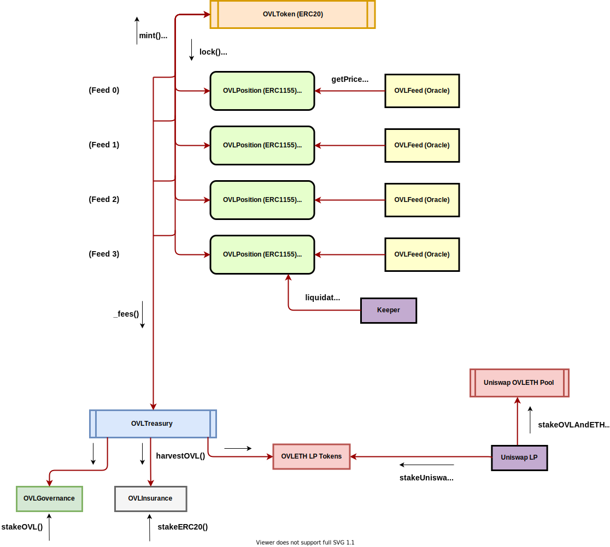

# Implementation Notes for OVL

### OVL Token (ERC20)

1. Allows holders to participate in long/short trading of data streams
2. Gives holders governance stake in proposed data feeds and tuning of their risk parameters
3. Gives holders governance control over treasury: revenue from fees assessed on each trade.

Three phases for initial token distribution (~ 10% to alpha testers, ~ 90% to yield farmers):
1. Token claim for alpha testers of trading mechanism (~ 10%)
2. Beta yield farming of $OVL with other Uniswap token pools: $SNXETH, $AAVEETH, $WBTCETH, etc.
3. Beta yield farming of more $OVL with seeded Uniswap $OVL/$ETH LP tokens

### OVL Position (ERC1155)

- NFT representing a trader's position,  received upon locking up OVL in a trade on a data stream

- Unique identifiers are attrs of the position: Lock price, data feed name, long/short side, leverage

- Tradeable/transferrable on secondary markets given ERC1155 standard

### Hackathon (v0)

- Only focus on BTC and ETH streams (the UNI incentivized pools) Uniswap pools for WBTCETH ($488M in liquidity) and ETHUSDT ($396M in liquidity), as well as associated Chainlink BTCUSD, ETHUSD, High Gas feeds.

- Have OVLv0 as fixed amount distributed via first come first serve for alpha testers

**v1** will be yield farming for rest of the token distribution (90%).

#### Spec

- Emphasis on modularity. Feed and trading position contracts act as their own modular capsule. Governance adds these in pairs.

- **OVLToken (ERC20 Token):** Base token with public `mint()`, `burn()` functions through `AccessControl` privileges

- **OVLPosition (ERC1155 Token):** Positions are NFTs. Allows for transfer of positions on secondary markets

- Position contracts have admin access to OVL token contract for mint/burn functions

- Position contracts fetch prices from associated feed contract whenever updates to the position occur





```
// Base ERC20 OVL token
interface OVLToken {

  function mint(uint256 _amount) public;

  function burn(uint256 _amount) public;

}

// Position ERC1155 NFT token
interface OVLPosition {

    IERC20 public token;

    struct Position {
       bool long
       uint256 balance
       uint256 leverage
       uint256 liquidationPrice
       uint256 price
    }

   mapping (uint256 => mapping(address => Position)) private _positions;

   function build(uint256 _amount, bool _long, uint256 leverage) public;

   function unwind(uint256 _id, uint256 _amount) public;

   function unwindAll(uint256 _id) public;

}
```

- Slightly diff architecture than firebase functions here in sense that once enter a position, get an NFT. Can’t unwind into completely opposite direction (i.e. switch from long to short requires locking in a new separate position)


#### Questions

1. How to deploy new OVLPosition => OVLFeed combos? ... Look to yearn controller/deployer

2. How to implement governance for deployment?

3. Where’s the treasury and fees in spec diagram?

4. What does the oracle feed interface look like?

5. How to make oracle feed interface so general that can accommodate Uniswap and Chainlink

6. Sell in fixed time increments to save on gas (pool gas fees until make trade)? Or every time user exits position, hit Uniswap and charge user (likely costly and slow)?

### Revenue Model

Fees (in $OVL): 0.15% per trade, adjustable by governance on feed-by-feed basis

- 50% is burned
- 50% is sold for ETH via Uniswap through treasury

To incentivize OVLETH liquidity providers and governance contributors for eternity, take the 50% of the ETH to treasury and divide evenly between
- 50% (25% of total fees) to OVLETH LPs staking
- 50% (25% of total fees) to governance $OVL stakers that vote

Eventually lend out the locked OVL from positions for capital efficiency and additional revenue.

### Roadmap

1. Long/Short w corresponding tokens on launch (ETH x DeFi token pools & feeds)
2. Uniswap and Chainlink oracles for base pair feeds
3. Gas ⛽️ oracle (front-run resistant) w feed (Chainlink)
4. Leverage
5. More feeds
6. New stablecoin based off composition of derivs
7. Lending of Locked OVL positions (likely through Aave)
8. Expiries?

**(1, 2, 3) are good proof of concept (POC) for the hack. Include 4, maybe.**
